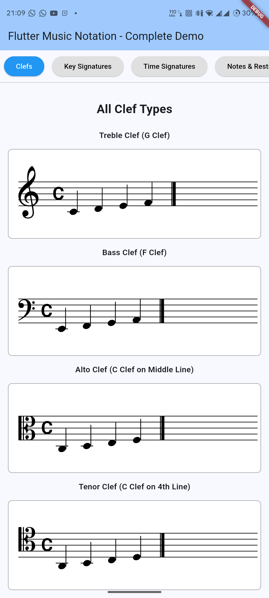
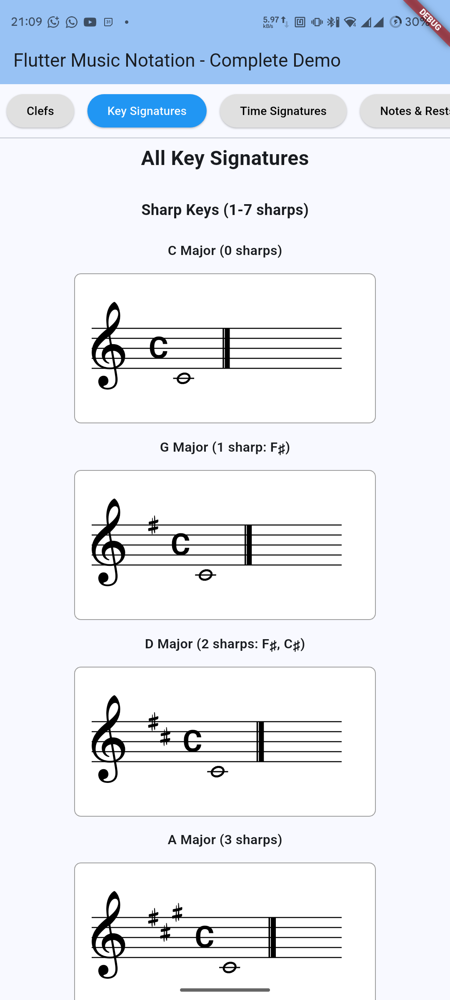
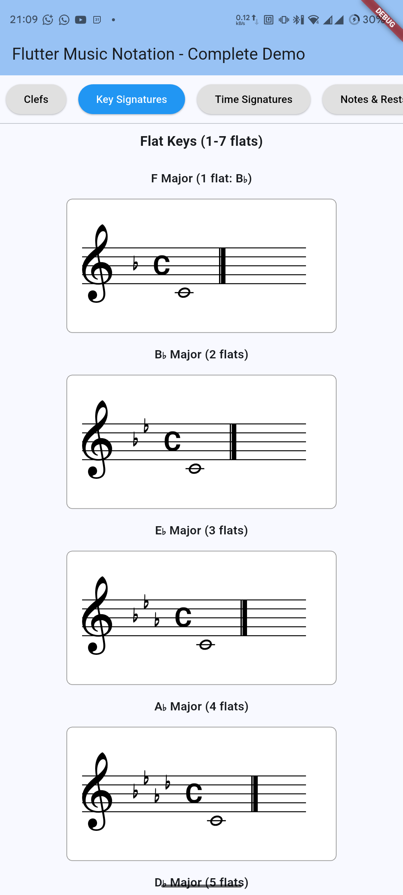
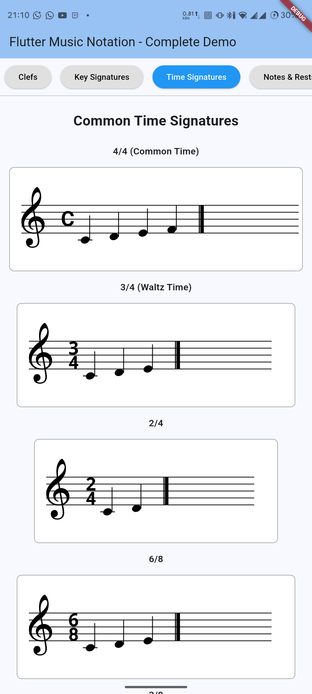
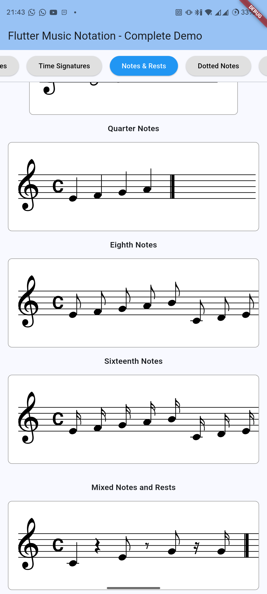
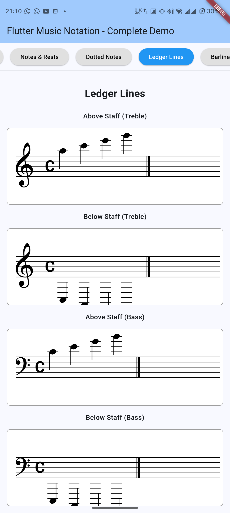
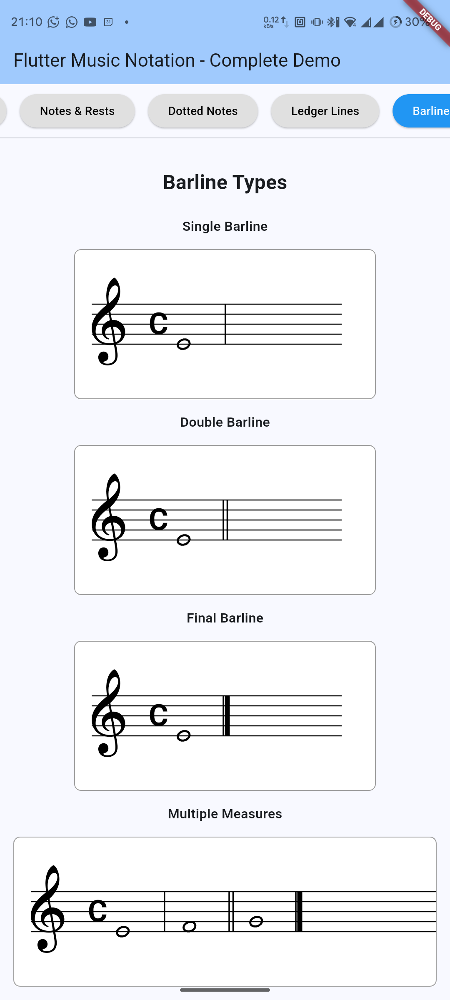

# Flutter Music Notation

A professional music notation rendering library for Flutter that displays standard Western music notation with beautiful, accurate engraving.

[](https://pub.dev/packages/flutter_music_notation)
[](https://opensource.org/licenses/BSD-3-Clause)

## Features

✅ **Complete Phase 3 Implementation**
- 🎼 All standard clefs (Treble, Bass, Alto, Tenor)
- 🎵 All key signatures (C Major through C♭ Major, 15 keys)
- 🎶 All time signatures (4/4, 3/4, 6/8, 2/2, etc.)
- 🎹 Professional note rendering with proper engraving standards
- 🎪 Rest symbols for all durations
- ⚫ Dotted notes (single and double dots)
- 📊 Flag rendering for eighth notes and shorter
- 📏 Ledger lines for notes above/below staff
- 🎯 Multiple barline types (single, double, final)
- 🎨 Beautiful SMuFL-compliant glyphs using Bravura font
- ⚡ 60fps playback with real-time note highlighting (from Phase 2)
- 🎸 Chord support with intelligent stem direction

## Screenshots

### 🎼 Basic Notation


### 🎵 Key Signatures

]

### 🕒 Time Signatures


### 🎹 Note & Rest Rendering


### 📏 Ledger Lines


### 🎯 Multiple Barlines



## Installation

Add this to your package's `pubspec.yaml` file:

```yaml
dependencies:
  flutter_music_notation: ^0.1.0
```

Then run:

```bash
flutter pub get
```

## Quick Start

### Simple Example - Display a C Major Scale

```dart
import 'package:flutter/material.dart';
import 'package:flutter_music_notation/flutter_music_notation.dart';

class MyMusicWidget extends StatelessWidget {
  @override
  Widget build(BuildContext context) {
    // Create a simple C major scale
    final measure = Measure(
      number: 0,
      timeSignature: TimeSignature.fourFour,
      keySignature: KeySignature.cMajor,
      notes: [
        Note(
          pitch: Pitch(noteName: NoteName.C, octave: 4),
          duration: const NoteDuration.quarter(),
          startBeat: 0.0,
        ),
        Note(
          pitch: Pitch(noteName: NoteName.D, octave: 4),
          duration: const NoteDuration.quarter(),
          startBeat: 1.0,
        ),
        Note(
          pitch: Pitch(noteName: NoteName.E, octave: 4),
          duration: const NoteDuration.quarter(),
          startBeat: 2.0,
        ),
        Note(
          pitch: Pitch(noteName: NoteName.F, octave: 4),
          duration: const NoteDuration.quarter(),
          startBeat: 3.0,
        ),
      ],
      endBarline: BarlineType.final_,
    );

    return NotationView(
      measures: [measure],
      config: const NotationConfig(
        staffSpaceSize: 12,
        clef: ClefType.treble,
      ),
    );
  }
}
```

## Core Concepts

### 1. Measures

A `Measure` is the fundamental container for musical notation. It includes:
- Time signature
- Key signature
- Notes and rests
- Barline type

```dart
final measure = Measure(
  number: 0,
  timeSignature: TimeSignature.fourFour,
  keySignature: KeySignature.gMajor,
  notes: [...],
  rests: [...],
  endBarline: BarlineType.double_,
);
```

### 2. Notes

Notes have a pitch, duration, and position:

```dart
final note = Note(
  pitch: Pitch(noteName: NoteName.C, octave: 4),
  duration: const NoteDuration.quarter(),
  startBeat: 0.0,
);
```

### 3. Pitch

Pitches use scientific pitch notation:

```dart
// Middle C (C4)
final middleC = Pitch(noteName: NoteName.C, octave: 4);

// F# in octave 5
final fSharp = Pitch(
  noteName: NoteName.F,
  accidental: Accidental.sharp,
  octave: 5,
);

// Create from MIDI number
final pitch = Pitch.fromMidiNumber(60); // C4
```

### 4. Duration

Note durations with dots and tuplets:

```dart
// Quarter note
const quarter = NoteDuration.quarter();

// Dotted half note
const dottedHalf = NoteDuration(type: DurationType.half, dots: 1);

// Eighth note triplet
const tripletEighth = NoteDuration(
  type: DurationType.eighth,
  tuplet: Tuplet.triplet,
);
```

### 5. Rests

Rests work similarly to notes:

```dart
const rest = Rest(
  duration: NoteDuration.quarter(),
  startBeat: 1.0,
);
```

## Key Signatures

All 15 major/minor key signatures are supported:

```dart
// Sharp keys
KeySignature.cMajor      // No sharps or flats
KeySignature.gMajor      // 1 sharp (F♯)
KeySignature.dMajor      // 2 sharps (F♯, C♯)
KeySignature.aMajor      // 3 sharps
KeySignature.eMajor      // 4 sharps
KeySignature.bMajor      // 5 sharps
KeySignature.fSharpMajor // 6 sharps
KeySignature.cSharpMajor // 7 sharps

// Flat keys
KeySignature.fMajor      // 1 flat (B♭)
KeySignature.bFlatMajor  // 2 flats (B♭, E♭)
KeySignature.eFlatMajor  // 3 flats
KeySignature.aFlatMajor  // 4 flats
KeySignature.dFlatMajor  // 5 flats
KeySignature.gFlatMajor  // 6 flats
KeySignature.cFlatMajor  // 7 flats

// Minor keys also available (e.g., KeySignature.aMinor)
```

## Time Signatures

Common time signatures:

```dart
TimeSignature.fourFour   // 4/4 (Common time)
TimeSignature.threeFour  // 3/4 (Waltz)
TimeSignature.twoFour    // 2/4
TimeSignature.sixEight   // 6/8
TimeSignature.threeEight // 3/8
TimeSignature.twelveEight // 12/8
TimeSignature.twoTwo     // 2/2 (Cut time)

// Custom time signatures
const customTime = TimeSignature(beats: 5, beatUnit: 4); // 5/4
```

## Clefs

Four standard clefs:

```dart
ClefType.treble  // G clef (most common)
ClefType.bass    // F clef (lower instruments)
ClefType.alto    // C clef on middle line (viola)
ClefType.tenor   // C clef on 4th line (cello, bassoon)
```

## Playback (Phase 2 Feature)

Add synchronized playback with note highlighting:

```dart
class MyMusicPlayer extends StatefulWidget {
  @override
  State<MyMusicPlayer> createState() => _MyMusicPlayerState();
}

class _MyMusicPlayerState extends State<MyMusicPlayer> {
  late PlaybackController _controller;
  late List<Note> _notes;

  @override
  void initState() {
    super.initState();
    _notes = _createNotes();
    _controller = PlaybackController(
      notes: _notes,
      beatsPerMinute: 120.0,
    );
  }

  @override
  Widget build(BuildContext context) {
    return Column(
      children: [
        // Notation with playback
        NotationView(
          measures: [_createMeasure()],
          playbackController: _controller,
        ),
        
        // Playback controls
        Row(
          children: [
            IconButton(
              icon: Icon(_controller.isPlaying ? Icons.pause : Icons.play_arrow),
              onPressed: () {
                if (_controller.isPlaying) {
                  _controller.pause();
                } else {
                  _controller.play();
                }
              },
            ),
            IconButton(
              icon: const Icon(Icons.stop),
              onPressed: () => _controller.stop(),
            ),
          ],
        ),
      ],
    );
  }

  @override
  void dispose() {
    _controller.dispose();
    super.dispose();
  }
}
```

## Configuration

Customize the notation appearance:

```dart
NotationView(
  measures: measures,
  config: NotationConfig(
    staffSpaceSize: 14.0,         // Size of staff space (default: 12)
    staffLineColor: Colors.black, // Staff line color
    noteColor: Colors.black,      // Note color
    activeNoteColor: Colors.green, // Color for active notes during playback
    clef: ClefType.treble,        // Which clef to use
    noteWidth: 50.0,              // Horizontal spacing between notes
    leftMargin: 80.0,             // Left padding for clef/signatures
    measureSpacing: 30.0,         // Space between measures
    width: 400.0,                 // Width of the notation container
  ),
)
```

## Examples

See the `example/` directory for comprehensive examples including:

1. **All Clefs** - Treble, bass, alto, and tenor clefs
2. **All Key Signatures** - 15 major keys with proper sharps/flats
3. **Time Signatures** - 4/4, 3/4, 6/8, 2/2, and more
4. **Note Durations** - Whole, half, quarter, eighth, sixteenth notes
5. **Dotted Notes** - Single and double dots
6. **Ledger Lines** - Notes above and below the staff
7. **Barlines** - Single, double, and final barlines
8. **Complete Pieces** - Ode to Joy, Mary Had a Little Lamb, Twinkle Twinkle

Run the example app:

```bash
cd example
flutter run
```

## Roadmap

### Phase 4: Layout & Spacing Engine (In Progress)
- Proportional spacing based on note duration
- Collision detection for accidentals
- Multi-measure layout with automatic line breaks
- Performance optimization

### Phase 5: Grand Staff (Piano)
- Two-staff system for piano notation
- Brace rendering
- Synchronized measures

### Phase 6: Advanced Features
- Beaming for eighth notes and shorter
- Ties and slurs with Bezier curves
- Tuplets (triplets, quintuplets, etc.)
- Dynamics markings (f, p, crescendo)
- Articulations (staccato, accent, fermata)

### Phase 7: MIDI Integration
- Complete MIDI file parsing
- Intelligent quantization
- Voice separation
- Full MIDI-to-notation conversion

### Phase 8: Polish & Release 1.0
- Comprehensive test coverage (80%+)
- Performance optimization
- Complete API documentation
- Tutorial videos

## Architecture

The library follows a clean, modular architecture:

```
Models → Geometry → Layout → Rendering → Widgets
  ↓         ↓          ↓         ↓          ↓
 Data   Positions  Spacing   Drawing   Display
```

- **Models**: Immutable data structures (Note, Pitch, Duration, Measure)
- **Geometry**: Staff position calculations, unit conversions
- **Layout**: Spacing algorithms, collision detection (Phase 4)
- **Rendering**: Low-level drawing of notation elements
- **Widgets**: High-level Flutter widgets for easy integration

## Design Principles

1. **Professional Quality**: SMuFL-compliant glyphs, proper engraving standards
2. **Performance**: 60fps rendering, efficient caching
3. **Immutability**: All models are immutable for predictable behavior
4. **Testability**: Every component is independently testable
5. **Extensibility**: Easy to add new features and customization

## Requirements

- Flutter 3.0 or higher
- Dart 3.0 or higher

## Contributing

Contributions are welcome! Please see [CONTRIBUTING.md](CONTRIBUTING.md) for guidelines.

### Development Setup

```bash
# Clone the repository
git clone https://github.com/adelaykay/flutter_music_notation.git
cd flutter_music_notation

# Install dependencies
flutter pub get

# Run tests
flutter test

# Run example
cd example
flutter run
```

## License

This project is licensed under the BSD-3-Clause License - see the [LICENSE](LICENSE) file for details.

The Bravura font used for music symbols is licensed under the SIL Open Font License.

## Acknowledgments

- **Bravura** and **Petaluma** © Steinberg Media Technologies GmbH
- **Music Engraving**: Based on best practices from "Behind Bars" by Elaine Gould

## Support

- 📖 [Documentation](https://pub.dev/documentation/flutter_music_notation/latest/)
- 💬 [GitHub Issues](https://github.com/adelaykay/flutter_music_notation/issues)
- 📧 Email: hello@empyrealworks.com

## Related Projects

- [simple_sheet_music](https://pub.dev/packages/simple_sheet_music) - Another music notation package
- [flutter_midi_16kb](https://pub.dev/packages/flutter_midi_16kb) - MIDI playback for Flutter

---

Made with ♥ by [Empyreal Digital Works]